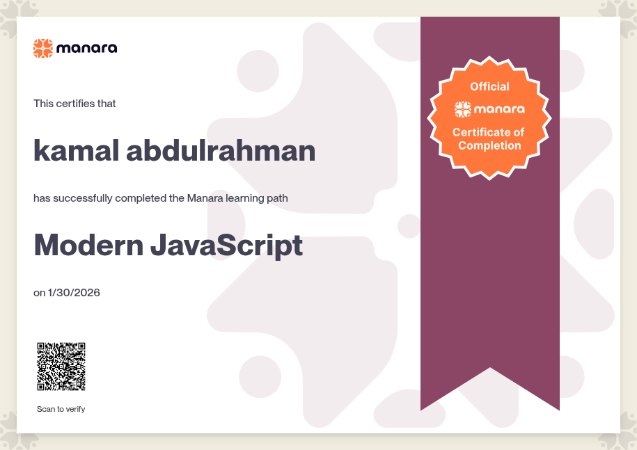

# Modern JavaScript

A collection of hands-on exercises and examples from a Modern JavaScript course. The material progresses from core language concepts to DOM work, asynchronous JavaScript, object-oriented programming, modules, and a small to-do application.

## Topics covered

- JavaScript fundamentals: variables, data types, operators, control flow, loops, and functions
- Arrays and objects
- DOM selection, manipulation, and element creation/removal
- Browser events and event-practice exercises
- Asynchronous JavaScript: callbacks, promises, `async`/`await`, and the Fetch API
- Object-oriented JavaScript: prototypes, classes, inheritance, and advanced OOP
- Modern JavaScript: modules, generators, and iterators
- Final project: a to-do app

## Getting started

Most examples are plain JavaScript files that can be run with Node.js:

```bash
node "JavaScript Fundamentals/01_Hello_World/hello_world.js"
```

For DOM and browser-based exercises, open the relevant `index.html` file in a modern web browser. For example:

```text
Understanding the DOM & DOM Manipulation/16_DOM_Selecting/index.html
```

No package installation or build step is required.

## Certification

Modern JavaScript learning-path certificate issued by Manara on January 30, 2026.



## Course

The exercises follow the [Modern JavaScript course on Manara](https://app.manara.tech/learning/33/landing-page?source=Classroom).
